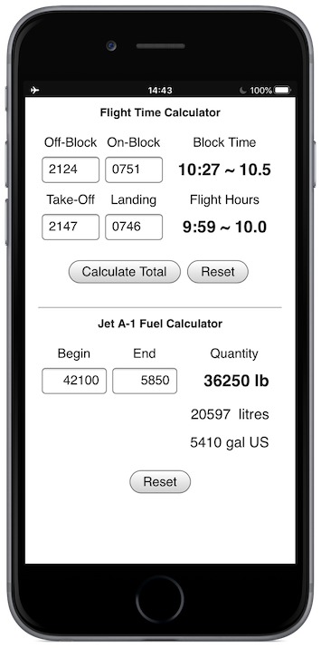

# ffCalc
- A simple Flight Time and Fuel Calculator designed primarily for use on mobile devices.

- Implemented as a Progressive Web App (PWA) to permit offline functionality.

## How to use it
### Block and Flight Time Calculator
- Enter times in 24 hour format, **without** any colon separator, then tap `Calculate Total`.
- Times entered as less than four digits **are** calculable.
- NO check is made on the validity of entered data; take care and check the resulting output.
- Results are displayed in the format "hh:mm ~ hh.h".

### Jet A-1 Fuel Calculator
The Fuel Calculator auto-updates the resulting difference between any entered Begin and End values, as they are entered. Simultaneously, a conversion
of the result value _in pounds (lb)_ is displayed as both litres (lb / 1.76) and US gallons (lb / 6.7) - occasionally useful info to communicate to a refuelling tanker driver for their planning purposes.

## Installation
To add ffCalc to your device Home Screen:

_**NB:** On Apple devices, only Safari browser permits saving PWAs to the Home Screen_.
- visit https://hairykiwi.github.io/ffCalc/ 
- Open your browser’s settings,
- Scroll down and tap Add to Home screen,
- Confirm by tapping Add.

## Credits
Many thanks to James Johnson for his tutorial - a big help in getting started. Read his article on Medium:

https://medium.com/james-johnson/a-simple-progressive-web-app-tutorial-f9708e5f2605

His demo code (which this PWA closely follows) is available here:
https://github.com/jamesjohnson280/hello-pwa

Credit for code snippets and other inspiration found around the web is included as comments in various project files.

## Browser compatibility
ffCalc has been tested in the following browsers:

* Chrome 80 (on mac)
* Firefox 72
* Safari 13

## Further development
Please send bug reports and feature requests - or clone it and crack on! :)
